# Referee Mentor System — User Guide

This guide is for **mentors**. It covers signing in, writing a session report, choosing games, checking workload, generating reports, and updating your account.

Open the site at [https://refmentoring.us](https://refmentoring.us).

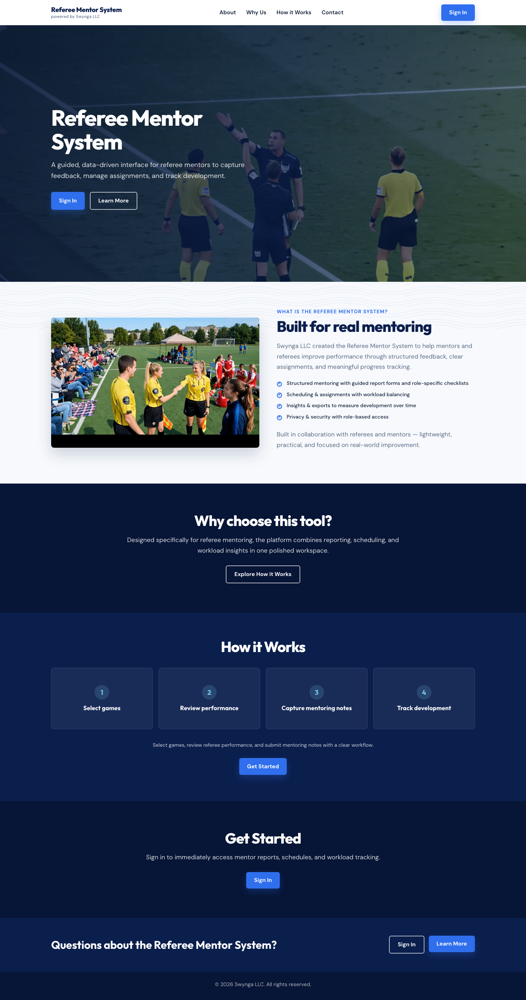

On a phone, the same page keeps **Sign In** in the header and hides the extra nav links:

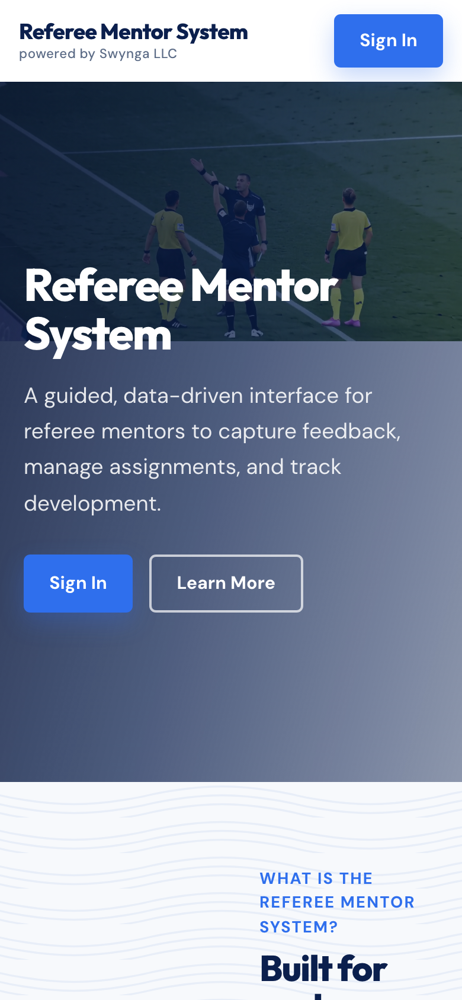

If you are already signed in, **Sign In** becomes **Open App**. **Help** in the header (desktop) and footer opens this guide.

---

## Sign in

1. Tap **Sign In**.
2. Choose your **Organization**. Use the club/league you mentor for — a valid username still fails if the wrong organization is selected.
3. Enter your **Username** and **Password**.
4. Tap **Login**.

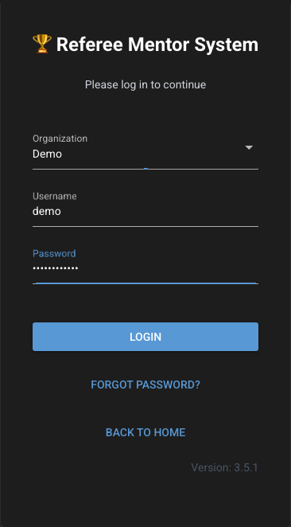

You land on **https://refmentoring.us/app**. The first load may show **Loading data...** until the weekend schedule is ready. The tabs across the top are how you move around once you are in.

### Forgot your password?

1. On the login screen, tap **Forgot Password?**
2. Enter the **Email Address** on your account and tap **Send Reset Email**.
3. Open the email and use the link. Links expire after **15 minutes**.
4. Set a new password. It must be at least 10 characters, with uppercase, lowercase, a digit, and a special character, and no spaces.

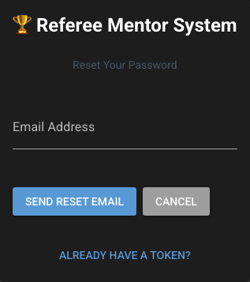

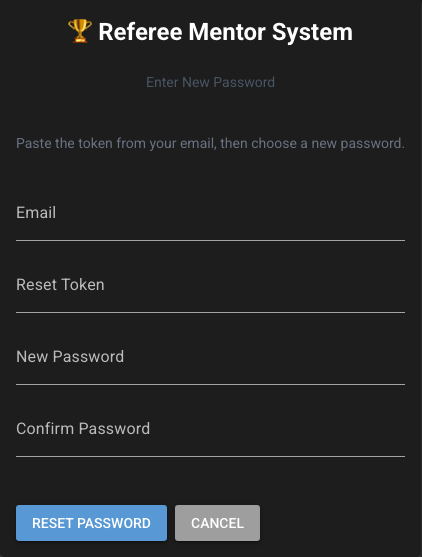

The site always says it sent instructions if the form is valid, even when the email is not in the system. That is intentional.

---

## The header and your account

After you sign in, the blue bar at the top is on every app page.

- The title (**Referee Mentor System**, or **RefMentor** on a phone) takes you back to the app home.
- The **?** button opens Help. Choose **View Documentation**.
- Your **avatar** (initials, or your photo if you uploaded one) opens the account menu.

In that menu:

- **Settings** — profile photo and password
- **Log out**
- Admins also see **User Management**, **User Activity**, and **Organizations**

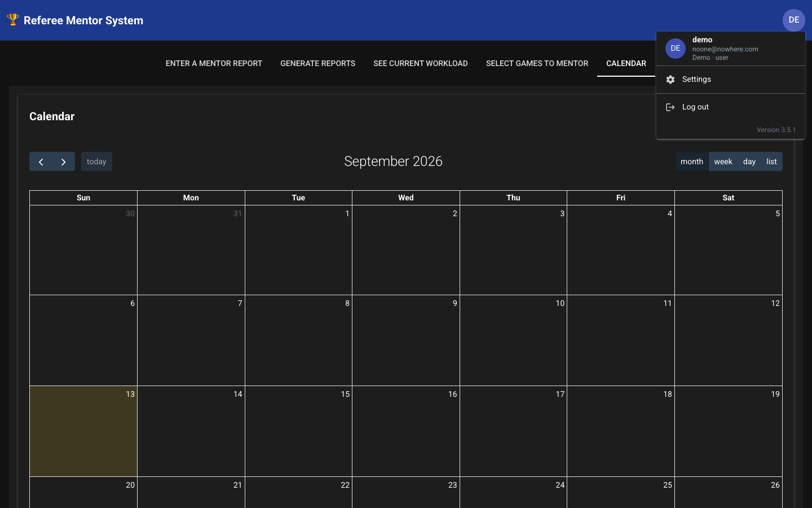

---

## The five tabs

The app home has five tabs. On a phone they sit in a tight row; swipe sideways if one is off-screen.

| Tab | What it is for |
|-----|----------------|
| **Report** | Enter a mentoring session |
| **Generate** | Preview and download past sessions |
| **Workload** | See current mentoring workload for your organization |
| **Select Games** | Claim upcoming weekend games with new referees |
| **Calendar** | Shared events for your group |

### Report — enter a mentoring session

1. Open **Report**.
2. Confirm **Select Mentor** (most mentors only see their own name).
3. Choose **Select Date**, then **Select Venue**, then **Select Game** (shown as kickoff time).
4. Under **Select referees being mentored**, check **Center**, **AR1**, and/or **AR2**. Empty or unassigned slots stay disabled.
5. Write **Comments**.
6. If someone should be seen again, check **Revisit Center**, **Revisit AR1**, or **Revisit AR2**.
7. Tap **Save**. Tap **Cancel** to clear comments and referee checkboxes without leaving the page.

You need a game, a mentor, and at least one referee checked. Each checked referee is stored as its own session.

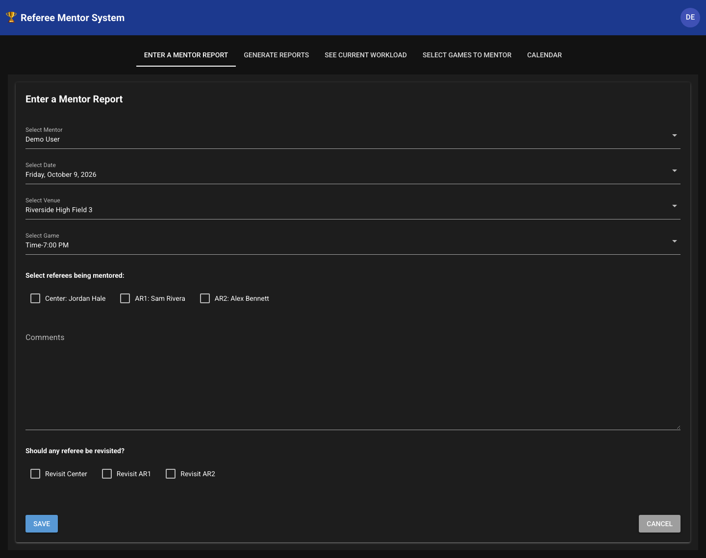

### Generate — reports and downloads

1. Open **Generate**.
2. Choose **Report Type**: `by year`, `by week`, `by referee`, or `by mentor`.
3. Fill in the matching selector (**Select Year**, **Select Week**, **Select Referee**, or **Select Mentor**).
4. Tap **Generate Report**.
5. Read the on-screen **Preview**, or tap **Download CSV** / **Download Excel**.

If nothing matches, you will see **No mentoring sessions found for this selection.**

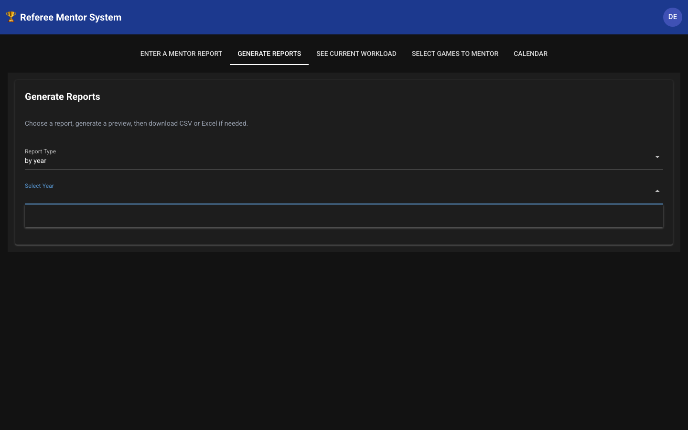

### Workload

Open **Workload**. This page is read-only. It shows **Current Workload** for your organization after the data finishes loading. There is nothing to submit.

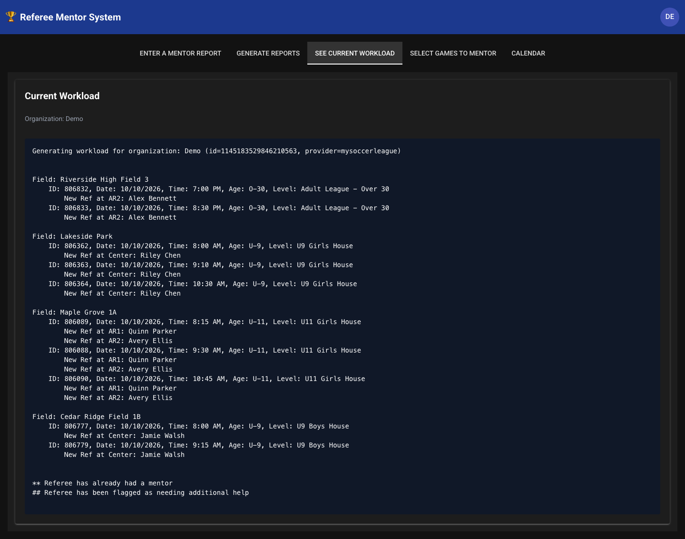

### Select Games — claim a weekend game

Use this tab to say which upcoming **Friday / Saturday / Sunday** games you will mentor. It is **not** the full season schedule. Only games that involve new referees (from the workload list) appear.

1. Open **Select Games**. Confirm the **Mentor** name is you.
2. Expand a day, then a venue, then a game.
3. Check **I will mentor this game**.

The first mentor to claim a game keeps it. If someone else already has it, the checkbox is disabled and the card shows **Selected by:** their name. Uncheck a game you claimed to release it.

If the list is empty, there are no new-referee games on the closest upcoming weekend yet.

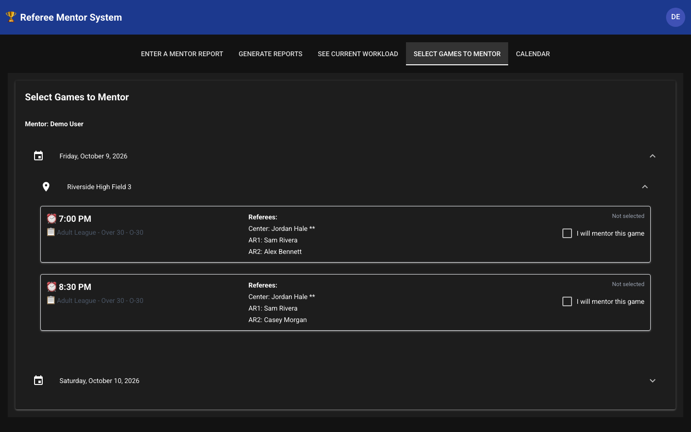

### Calendar

1. Open **Calendar**.
2. Use month / week / day / list and the **today** / arrow controls to move around.
3. Tap **Add Event**, or tap a day, to create one. Fill **Title**, **Description**, **Start Date & Time**, and optionally **End Date & Time**, then **Save**.
4. Tap an existing event to edit it. **Delete** removes it. You can also drag an event to a new day.
5. **Refresh Calendar** reloads events if something looks stale.

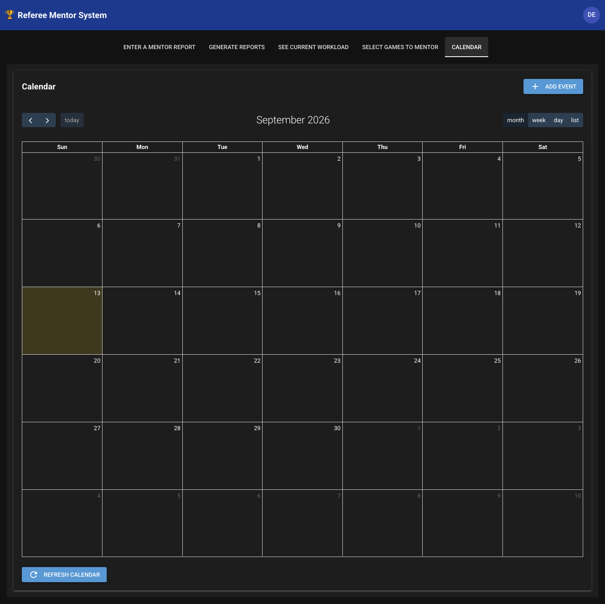

---

## Settings

Open your avatar, then **Settings**.

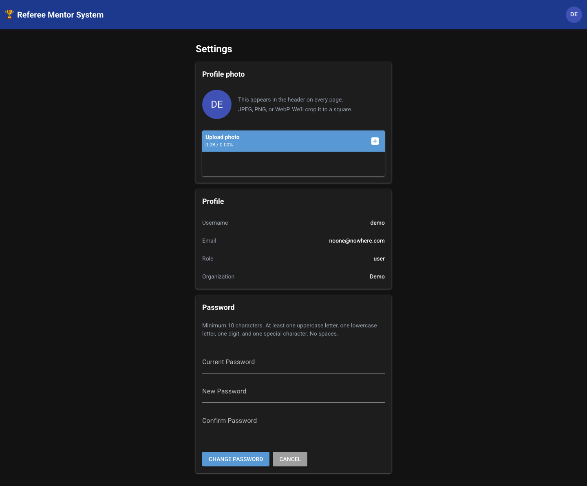

### Profile photo

- Upload a **JPEG, PNG, or WebP** (max 5 MB). The app crops it to a square and uses it in the header.
- **Remove photo** goes back to initials.
- iPhone **HEIC** photos may not upload; choose JPEG if you hit an error.

### Profile

**Username**, **Email**, **Role**, and **Organization** are shown here. They are not editable on this page — ask an admin if something is wrong.

### Appearance

Turn **Dark mode** on or off. The choice is saved on your account and used on every device you log in from.

### Password

Enter **Current Password**, **New Password**, and **Confirm Password**, then **Change Password**. After a successful change you are signed out and must log in again with the new password. **Cancel** returns to the app.

---

## On a phone

- You can use a regular mobile browser, or add the site to your home screen (it is a PWA and opens at `/app`).
- Prefer the avatar menu over hunting for account links.
- For **Select Games** and **Report**, scroll the form; the important buttons are at the bottom of each card.

---

## If something goes wrong

| What you see | What to try |
|--------------|-------------|
| Invalid username, password, or organization | Confirm **Organization** first, then username/password |
| Loading data... that does not finish | Wait a minute and refresh. Schedule data is loaded in the background |
| Cannot check a referee | That slot is unassigned (`None`, `--`, or `(requested)`) |
| Cannot claim a game | Another mentor already selected it |
| Reset email did not arrive | Check spam, wait a minute, and remember the link lasts 15 minutes |
| Photo upload fails | Use JPEG/PNG under 5 MB |

Need an account, a name change, or access to another organization? Ask an administrator.

---

## For administrators

Admins have the same mentor tools, plus an **Admin** section in the avatar menu:

- **User Management** — create users, set role (`user` or `admin`), add/remove organization membership
- **User Activity** — last login and login history for an organization
- **Organizations** — create or delete organizations

Non-admins who open those pages are sent back to the app.
